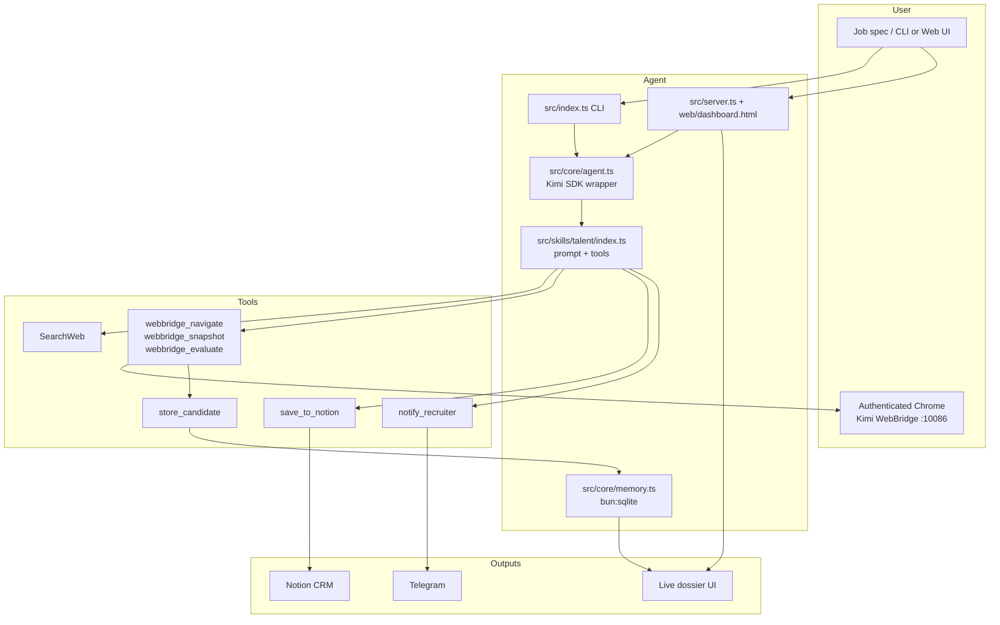

# Talent Intelligence Agent

AI talent intelligence agent powered by **Kimi K2.6**. Give it a job spec; it discovers LinkedIn candidates through your real, logged-in Chrome (via Kimi WebBridge), scrapes and scores them on a 5-gate rubric, drafts personalized outreach, and delivers a ranked shortlist to **Notion** + **Telegram**.

## Demo

https://github.com/user-attachments/assets/15ef6d89-bde8-40ea-970b-0fdfd6b9c37a

> The demo shows a live run from the web UI: entering a job spec, watching the agent plan, scrape LinkedIn profiles, score candidates, and populate the dossier in real time.

## What it does

- **Discovers** candidates via web search (`site:linkedin.com/in ...`).
- **Scrapes** profiles through your authenticated Chrome session using Kimi WebBridge — no API keys, no fragile anonymous browsers.
- **Scores** every profile through 5 weighted gates: Skills (35%), Seniority (25%), Location (20%), Recency (10%), Standout (10%).
- **Drafts** hyper-personalized LinkedIn messages and emails for the top 10 matches.
- **Delivers** the ranked shortlist to a Notion CRM database and a Telegram chat.
- **Surfaces everything** in a local web dashboard with live WebSocket updates, run history, replay, and human-in-the-loop outreach sending.

## Tech stack

| Layer | Choice |
|-------|--------|
| Runtime | Bun + TypeScript |
| Agent runtime | `@moonshot-ai/kimi-agent-sdk` (drives the local `kimi` CLI over stdio JSON-RPC) |
| LLM | Kimi K2.6 (OAuth via Kimi CLI, no API key needed) |
| Browser automation | Kimi WebBridge (your real Chrome on port `10086`) |
| Search | `SearchWeb` built-in tool |
| Storage | `bun:sqlite` (`data/talent.db`) |
| CRM | Notion API |
| Notifications | Telegram Bot API |
| Web UI | Single-file `web/dashboard.html` + `Bun.serve` HTTP/WebSocket |

## Architecture



### Key modules

- `src/core/agent.ts` — thin wrapper over `@moonshot-ai/kimi-agent-sdk`. Spawns the local `kimi` CLI, handles session lifecycle, streaming events, and tool dispatch. Includes an event assembler that reconstructs full tool-call arguments from streamed deltas.
- `src/core/memory.ts` — `bun:sqlite` persistence for run logs, candidates, outreach drafts, and cache.
- `src/core/types.ts` — shared framework types: `AgentConfig`, `AgentEvent`, `SkillDef`, `TokenUsage`, etc.
- `src/skills/talent/` — the talent skill: system prompt, prompt builder, and tool wiring.
- `src/tools/` — external tool handlers that run in-process:
  - `storage.ts` — `store_candidate` (SQLite upserts)
  - `webbridge.ts` — WebBridge navigation, snapshot, evaluate, click
  - `notion.ts` — `save_to_notion`
  - `telegram.ts` — `notify_recruiter`
- `src/web/` — `api.ts` (DB-to-view helpers) and `runManager.ts` (run lock, interrupt, steer, human-approved send).
- `src/server.ts` — `Bun.serve` HTTP + WebSocket app. Binds `127.0.0.1` only because it drives the user's real Chrome.
- `web/dashboard.html` — the single-file dossier UI.

## Workflow

1. **DISCOVER** — 3-5 `SearchWeb` queries collect 20-30 unique LinkedIn profile URLs.
2. **SCRAPE** — WebBridge navigates each profile in the user's real Chrome, extracts name, headline, location, role, company, skills, experience, and summary. Auth-walled profiles are skipped.
3. **SCORE** — Each profile is scored 0-100 across the 5 gates.
4. **DRAFT** — Top 10 candidates (score ≥ 60) get personalized LinkedIn messages and email bodies.
5. **DELIVER** — Top candidates are written to Notion and a shortlist is sent to Telegram.

## Setup

```bash
bun install
```

Install and authenticate the **Kimi CLI** (OAuth, no API key):

```bash
# install
curl -fsSL https://moonshotai.github.io/kimi-cli/install.sh | bash

# login
kimi login
```

Start Kimi WebBridge so the agent can drive your authenticated Chrome:

```bash
kimi webbridge start
```

Copy `.env.example` to `.env` and fill in optional delivery credentials:

```bash
cp .env.example .env
```

```env
TELEGRAM_BOT_TOKEN=your_bot_token_here
TELEGRAM_CHAT_ID=your_chat_id_here
NOTION_API_KEY=your_notion_api_key_here
NOTION_TALENT_DB_ID=your_notion_database_id_here
KIMI_EXECUTABLE=/Users/yashbishnoi/.local/bin/kimi
TALENT_DB_PATH=./data/talent.db
MAX_PROFILES=30
```

> Notion and Telegram are optional — the agent runs in draft mode and skips delivery if credentials are unset.

## CLI

```bash
bun run talent "Senior ML Engineer Python PyTorch London"
bun run talent "Staff SWE Distributed Systems remote UK" --thinking
bun run talent "Data Scientist fintech London" --no-notion --no-telegram
```

Flags:

- `--thinking` — enable deeper Kimi K2.6 reasoning for scoring
- `--no-notion` — skip Notion CRM entries
- `--no-telegram` — skip Telegram notification

## Web UI

```bash
bun run web   # → http://127.0.0.1:3000  (set PORT to change)
```

From the browser you can:

- **Launch** a run with a job spec and toggles for thinking, Notion, and Telegram.
- **Watch it live** — steps, token usage, context %, tool calls, sub-agent activity, and the agent's todo plan, with candidates streaming into the dossier as they're stored.
- **Interrupt or steer** a run mid-flight (e.g. "only London, skip recruiters").
- **Browse and replay** any past run from `data/talent.db` via the run picker.
- **Edit and send** outreach drafts one candidate at a time with human approval.

The server binds to `127.0.0.1` only and runs **one run at a time** — it drives your real Chrome via WebBridge and must stay local.

## Development

```bash
bun test              # run the test suite
bun run typecheck     # tsc --noEmit
bun run build         # bundle to dist/
```

## Safety & boundaries

- **Never auto-sends outreach.** LinkedIn messages and emails are drafted only; sending is a separate, human-approved per-candidate action through the web UI.
- Caps profile scraping at `MAX_PROFILES` (default 30, hard ceiling 50).
- Waits ~2 seconds between LinkedIn navigations to avoid rate-limiting.
- Does not log candidate PII to stdout.
- Skips auth-walled profiles instead of trying to bypass LinkedIn authentication.

## Project docs

- `AGENTS.md` — project rules and workflow for the agent
- `system.md` — runtime system prompt
- `docs/superpowers/specs/2026-06-08-talent-web-ui-design.md` — web UI design spec
- `docs/superpowers/plans/2026-06-08-talent-web-ui.md` — build plan

## License

MIT
